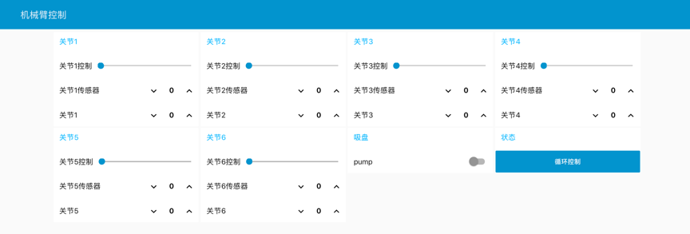

本项目以Firmata协议为桥梁, 通过集成Cylon.js(一款基于Node.js的机器人开发软件包), 为Node-RED可视化编程平台添加机械臂控制节点, 从而达到可视化编程机械臂操作的目的.
可视化控制: Node-RED的Dashboard模块提供零基础的用户界面编程方式, 为机械臂的控制提供元数据. 本项目对元数据进行打包处理, 通过Socket通信的方式传输到Cylon.js服务端,即Node-Red做Firmata的主机端. Cylon.js对接收的数据进行协议转换, 使数据符合Firmata协议. 7Bot从机,即Arduino Due, 烧录标准的Firmata协议解析程序, 处理来自主机的信息, 将数据量转换为舵机的角度, 从而达到控制目的.
机械臂姿态感知: 姿态感知的通信方式与实现与控制大抵相同, 是其逆过程. 姿态感知的本质是读取舵机的模拟信号量, 机械臂共有6个关节, 其组合可以唯一确定机械臂的姿态.
 关键词：Arduino due, Node.js，Node-RED，7Bot